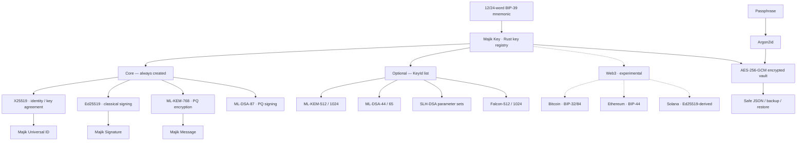

# Majik Key

[](https://crates.io/crates/majik-key) [](https://docs.rs/majik-key) [](https://opensource.org/licenses/Apache-2.0)
[](https://doi.org/10.5281/zenodo.23208491) [](https://majikah.solutions/articles/majik-key-whitepaper)

[](https://www.thezelijah.world)

**Majik Key** is a pure-Rust, post-quantum-ready seed phrase account library for the Majikah ecosystem.

It turns one BIP-39 mnemonic into a deterministic, multi-algorithm cryptographic identity: classical encryption and signing, post-quantum encryption and signing, and optional experimental Bitcoin, Ethereum, and Solana key material. Private key material is encrypted at rest with AES-256-GCM under a vault key derived from the account passphrase with Argon2id.

The Rust crate intentionally mirrors the portable account model used by the TypeScript implementation while taking advantage of Rust's ownership, borrowing, synchronous APIs, and `zeroize` protections.

[](LICENSE)

---

## Table of Contents

- [Majik Key](#majik-key)
  - [Table of Contents](#table-of-contents)
  - [Why Majik Key](#why-majik-key)
  - [What you get by default](#what-you-get-by-default)
  - [Quick Start](#quick-start)
  - [Installation](#installation)
  - [Multi-key support](#multi-key-support)
    - [Supported keys](#supported-keys)
      - [Why LMS is not offered](#why-lms-is-not-offered)
      - [Why Falcon is separate from FN-DSA](#why-falcon-is-separate-from-fn-dsa)
    - [Choosing keys at creation](#choosing-keys-at-creation)
    - [Reading keys](#reading-keys)
    - [Adding keys later](#adding-keys-later)
  - [Rust API design](#rust-api-design)
    - [Synchronous by design](#synchronous-by-design)
    - [Zeroized secret material](#zeroized-secret-material)
    - [Borrowed keypair handles](#borrowed-keypair-handles)
  - [Backward compatibility \& recovery](#backward-compatibility--recovery)
  - [🚨 If anything ever goes wrong, re-import your seed phrase 🚨](#-if-anything-ever-goes-wrong-re-import-your-seed-phrase-)
  - [Security Architecture](#security-architecture)
    - [Vault encryption](#vault-encryption)
    - [How keys are derived](#how-keys-are-derived)
    - [Zeroization and locking](#zeroization-and-locking)
    - [Mnemonic languages](#mnemonic-languages)
    - [Local-first execution](#local-first-execution)
  - [Architecture](#architecture)
  - [Powering the Majikah Ecosystem](#powering-the-majikah-ecosystem)
    - [Majik Signature](#majik-signature)
    - [Majik Message](#majik-message)
    - [Majik Buwiz](#majik-buwiz)
    - [Majik Universal ID \& Majik SLink](#majik-universal-id--majik-slink)
  - [Experimental Web3 Support](#experimental-web3-support)
    - [Bitcoin](#bitcoin)
    - [Ethereum](#ethereum)
    - [Solana](#solana)
  - [API Reference](#api-reference)
    - [Associated functions](#associated-functions)
    - [Instance methods](#instance-methods)
    - [Registry methods](#registry-methods)
    - [Serialization and integration](#serialization-and-integration)
    - [Getters](#getters)
    - [Web3 methods](#web3-methods)
    - [Deprecated compatibility methods](#deprecated-compatibility-methods)
  - [Usage Examples](#usage-examples)
    - [1. Create an account](#1-create-an-account)
    - [2. Read public keys while locked](#2-read-public-keys-while-locked)
    - [3. Unlock, use a secret, then lock](#3-unlock-use-a-secret-then-lock)
    - [4. Scoped secret access with `with_auto_lock`](#4-scoped-secret-access-with-with_auto_lock)
    - [5. Verify a passphrase](#5-verify-a-passphrase)
    - [6. Add algorithms later](#6-add-algorithms-later)
    - [7. Save and restore JSON](#7-save-and-restore-json)
    - [8. Mnemonic backup and recovery](#8-mnemonic-backup-and-recovery)
    - [9. Dangerous server-side secret injection](#9-dangerous-server-side-secret-injection)
    - [10. Experimental Web3 usage](#10-experimental-web3-usage)
  - [TypeScript compatibility](#typescript-compatibility)
    - [Compatible concepts](#compatible-concepts)
    - [Deliberate Rust differences](#deliberate-rust-differences)
    - [Shared serialization model](#shared-serialization-model)
  - [Performance considerations](#performance-considerations)
    - [Argon2id](#argon2id)
    - [Post-quantum algorithms](#post-quantum-algorithms)
    - [One vault key per operation](#one-vault-key-per-operation)
  - [Security Best Practices](#security-best-practices)
    - [✅ Do](#-do)
    - [❌ Don't](#-dont)
  - [Ecosystem](#ecosystem)
  - [License](#license)
  - [Author](#author)
  - [Contact](#contact)

---

## Why Majik Key

- **One seed, one identity, many keys.** A 12- or 24-word BIP-39 mnemonic deterministically derives the account's key material. Re-importing the same mnemonic reproduces the same identity and derivation results.
- **A key registry, not a fixed key set.** Keys are addressed by namespaced IDs such as `classic:x25519`, `classic:ed25519`, `pq:ml-kem-768`, and `pq:ml-dsa-87`.
- **Post-quantum from day one.** New accounts include ML-KEM-768 (FIPS 203) and ML-DSA-87 (FIPS 204) alongside X25519 and Ed25519.
- **Encrypted at rest.** Stored private key material is sealed with AES-256-GCM using a 256-bit vault key derived from the passphrase with Argon2id.
- **Recoverable by design.** The mnemonic is the root secret; the seed itself is not stored inside the account vault.
- **Local-first.** Key generation, derivation, encryption, and recovery are local cryptographic operations. The crate does not require a network connection.
- **Rust-native security boundaries.** Secret values are wrapped in `zeroize`-backed types and returned as owned, zeroizing copies where appropriate.
- **Compatible account model.** The registry JSON format is designed to interoperate with the Majikah TypeScript implementation and earlier flat-field account exports.

---

## What you get by default

Every new account automatically derives these **four core keypairs**:

| Key ID | Algorithm | Purpose |
| :--- | :--- | :--- |
| `classic:x25519` | X25519 | Identity and classical key agreement |
| `classic:ed25519` | Ed25519 | Classical signing |
| `pq:ml-kem-768` | ML-KEM-768 (FIPS 203) | Post-quantum key encapsulation |
| `pq:ml-dsa-87` | ML-DSA-87 (FIPS 204) | Post-quantum signing |

A Solana key (`web3:sol`) is exposed as a **derived view** from the Ed25519 key and does not require a separate stored secret.

Additional algorithms are opt-in through `MajikKeyCreateOptions::keys`.

```rust
use majik_key::{KeyId, MajikKey, MajikKeyCreateOptions};

let options = MajikKeyCreateOptions {
    keys: vec![KeyId::Eth, KeyId::MlKem1024],
    ..Default::default()
};

let key = MajikKey::create(
    &mnemonic,
    "super-secure-passphrase",
    Some("My Account"),
    &options,
)?;
```

The `keys` list is **additive**. The core four are always included, duplicate requests collapse, and unsupported or non-enableable IDs are rejected before derivation begins.

---

## Quick Start

```rust
use majik_key::{KeyId, MajikKey, MajikKeyCreateOptions, MnemonicLanguage};

fn main() -> Result<(), Box<dyn std::error::Error>> {
    // 1. Generate a 12-word BIP-39 mnemonic.
    let mnemonic = MajikKey::generate_mnemonic(128, MnemonicLanguage::default())?;

    // 2. Create the account. New accounts are returned UNLOCKED.
    let options = MajikKeyCreateOptions::default();
    let mut key = MajikKey::create(
        &mnemonic,
        "super-secure-passphrase",
        Some("My PQ Account"),
        &options,
    )?;

    // 3. Public identity is available regardless of lock state.
    println!("Fingerprint: {}", key.fingerprint());
    println!("Unlocked? {}", key.is_unlocked());
    println!("Available keys: {:?}", key.available_keys(None));

    // 4. Public key material works while unlocked or locked.
    let public = key.get_public_key(KeyId::MlDsa87)?;
    println!("ML-DSA-87 public key: {} bytes", public.len());

    // 5. Lock to purge secret material from memory.
    key.lock();

    // 6. Unlock only when a secret operation is needed.
    key.unlock("super-secure-passphrase")?;

    // 7. Read a secret as an owned zeroizing buffer.
    let private = key.get_private_key(KeyId::MlDsa87)?;
    println!("ML-DSA-87 private key: {} bytes", private.len());

    // 8. Serialize safely. Raw secrets are never placed in to_json().
    let json = key.to_json_string(true)?;
    println!("{}", json);

    Ok(())
}
```

> **Important:** the API is synchronous. Argon2id is intentionally expensive, so applications with async runtimes or interactive UIs should move account creation/unlock/migration work to a blocking worker such as `tokio::task::spawn_blocking`.

---

## Installation

Add the crate from crates.io:

```bash
cargo add majik-key
```

Or add it manually:

```toml
[dependencies]
majik-key = "1.0"
```

The crate is a native Rust library:

```rust
use majik_key::{KeyId, MajikKey, MajikKeyCreateOptions, MnemonicLanguage};
```

The library itself does not expose a command-line executable. If you need a single native CLI binary, build a small Rust binary crate that depends on `majik-key`.

---

## Multi-key support

### Supported keys

Each key is addressed by a namespaced `KeyId`.

| Family | Key ID | Algorithm | Status |
| :--- | :--- | :--- | :--- |
| classic | `KeyId::X25519`, `KeyId::Ed25519` | X25519, Ed25519 | ✅ Core — always created |
| pq (KEM) | `KeyId::MlKem768` | ML-KEM-768 | ✅ Core — always created |
| pq (KEM) | `KeyId::MlKem512`, `KeyId::MlKem1024` | ML-KEM-512 / 1024 | ✅ Stable, opt-in |
| pq (signature) | `KeyId::MlDsa87` | ML-DSA-87 | ✅ Core — always created |
| pq (signature) | `KeyId::MlDsa44`, `KeyId::MlDsa65` | ML-DSA-44 / 65 | ✅ Stable, opt-in |
| pq (signature) | `KeyId::SlhDsa...` | SLH-DSA parameter sets | ✅ Stable, opt-in |
| pq (signature) | `KeyId::Falcon512`, `KeyId::Falcon1024` | Falcon | 🧪 Experimental |
| web3 | `KeyId::Btc` | Bitcoin / secp256k1, BIP-32/84 | 🧪 Experimental, opt-in |
| web3 | `KeyId::Eth` | Ethereum / secp256k1, BIP-44 | 🧪 Experimental, opt-in |
| web3 | `KeyId::Sol` | Solana / Ed25519-derived | 🧪 Experimental, derived view |
| pq (KEM) | `KeyId::Hqc128`, `KeyId::Hqc192`, `KeyId::Hqc256` | HQC | ⏳ Reserved |
| pq (signature) | `KeyId::FnDsa512`, `KeyId::FnDsa1024` | FN-DSA | ⏳ Reserved |
| pq (signature) | `KeyId::Lms` | LMS / HSS | 🚫 Not supported |

Use:

```rust
let supported = MajikKey::supported_keys();
println!("{supported:?}");
```

`supported_keys()` reports the algorithms this crate can actually create or enable. Reserved and unsupported IDs are not returned.

#### Why LMS is not offered

LMS is stateful: every signature consumes a one-time signing index that must never be reused. Mnemonic recovery, backups, restores, and multi-device use can reset that state. That conflicts with Majik Key's deterministic recovery model, so LMS/HSS is deliberately not exposed as a normal key type.

#### Why Falcon is separate from FN-DSA

The crate treats Falcon and FN-DSA as different algorithm identities. Falcon refers to the Round-3 Falcon design; FN-DSA is the standardized family represented separately when appropriate. The registry does not silently reinterpret an existing `pq:falcon-*` identity later.

---

### Choosing keys at creation

```rust
use majik_key::{KeyId, MajikKeyCreateOptions};

let options = MajikKeyCreateOptions {
    mnemonic_language: Some(MnemonicLanguage::default()),
    keys: vec![
        KeyId::MlKem1024,
        KeyId::MlDsa65,
        KeyId::Eth,
        KeyId::Btc,
    ],
    derive_bitcoin: false,
};

let key = MajikKey::create(
    &mnemonic,
    passphrase,
    Some("PQ + Web3"),
    &options,
)?;
```

`derive_bitcoin` remains for compatibility but is deprecated in favor of `keys: vec![KeyId::Btc]`.

The same options model is used by `from_mnemonic_json()` and `import_from_mnemonic_backup()`.

---

### Reading keys

Presence and inventory checks work while the account is locked:

```rust
use majik_key::{KeyFamily, KeyId};

assert!(key.has_key(KeyId::X25519));
assert!(key.has_keys(&[KeyId::Ed25519, KeyId::MlDsa87]));

let missing = key.missing_keys(None);
let post_quantum = key.available_keys(Some(KeyFamily::Pq));
let inventory = key.list_keys();
```

Public and private bytes are deliberately separate:

```rust
let public = key.get_public_key(KeyId::MlDsa87)?;  // Works while locked.

key.unlock(passphrase)?;
let private = key.get_private_key(KeyId::MlDsa87)?; // Returns Zeroizing<Vec<u8>>.
```

A live keypair handle can also be requested:

```rust
let pair = key.get_keypair(KeyId::Ed25519)?;
let public = pair.public();
let private = pair.private()?;
```

The handle **borrows the account**. Rust's borrow checker prevents `lock()` from mutating the account while a handle is alive, which is the native Rust equivalent of the TypeScript implementation's live-handle semantics.

---

### Adding keys later

The seed is never stored. If you want to add another algorithm later, provide the original mnemonic and current passphrase:

```rust
use majik_key::KeyId;

let added = key.add_keys(
    &[KeyId::Eth, KeyId::MlKem1024],
    &mnemonic,
    passphrase,
)?;

println!("Added: {added:?}");
```

`add_keys()`:

- requires Argon2id; migrate legacy accounts first with `migrate()`;
- verifies the passphrase against the existing X25519 ciphertext;
- verifies that the supplied mnemonic reproduces the account fingerprint;
- skips keys already present;
- derives only missing keys;
- encrypts new secrets under the existing vault key;
- keeps new secrets encrypted when the account is locked.

This makes adding an algorithm deterministic without requiring the mnemonic to be stored inside the vault.

---

## Rust API design

### Synchronous by design

The TypeScript implementation uses async APIs because browser/WebCrypto/WASM environments may be asynchronous. The Rust crate does not need that abstraction.

All public cryptographic operations are synchronous:

```rust
let key = MajikKey::create(...)?;
key.unlock(passphrase)?;
let signature_key = key.get_private_key(KeyId::Ed25519)?;
```

This is intentionally simple for native Rust, CLI applications, servers, Tauri applications, and other desktop software.

For async applications, move expensive operations off the main executor thread:

```rust
let result = tokio::task::spawn_blocking(move || {
    MajikKey::create(&mnemonic, &passphrase, Some("Account"), &options)
})
.await??;
```

The crate itself does **not** require Tokio.

### Zeroized secret material

Secret values use `zeroize`-backed types where the API can own them safely.

```rust
let private = key.get_private_key(KeyId::MlDsa87)?;
// `private` is wiped when it is dropped.
```

Callers should still follow normal secret-handling rules: do not log secrets, place them in persistent strings unnecessarily, or copy them into non-zeroizing containers unless the consuming API requires it.

### Borrowed keypair handles

`get_keypair()` returns `MajikKeypair<'_>` rather than a detached heap object containing copied secrets. The returned handle borrows the account, so Rust's lifetime rules prevent the account from being locked or mutated while the borrowed handle is in scope.

This gives Rust callers a compile-time guarantee that a handle cannot silently retain stale secret material after `lock()`.

---

## Backward compatibility & recovery

The Rust crate is designed around the same portable account format used by Majik Key's TypeScript implementation.

| Existing data | Rust behavior |
| :--- | :--- |
| Registry JSON containing `keys` | Loaded directly through `from_json()` / `from_json_str()`. |
| Older flat JSON with no `keys` field | Auto-migrated in memory to the registry representation. |
| Legacy PBKDF2 account | Still readable; `migrate()` upgrades encryption to Argon2id. |
| Account missing newer core keys | Loads normally; `missing_keys(None)` reports the gaps. |
| Old mnemonic backup | Legacy backup KDF/salt handling is retained for verification. |
| JSON containing newer key entries | Future entries can remain preserved by the serialized registry even if the current crate cannot use them. |

By default, `to_json()` writes both the registry (`keys`) and the legacy flat fields for compatibility. Use `to_json_with(&MajikKeyToJsonOptions { legacy: false })` when you explicitly want registry-only output.

---

## <h1 style="color:#d1242f;">🚨 If anything ever goes wrong, re-import your seed phrase 🚨</h1>

> **Every key is deterministically derived from the mnemonic.** Re-importing the same mnemonic reproduces the same account identity and the same frozen derivation recipes, independent of the passphrase used to protect the local vault.

A complete recovery can be as simple as:

```rust
use majik_key::{MajikKey, MajikKeyCreateOptions, KeyId};

let options = MajikKeyCreateOptions {
    keys: vec![KeyId::Eth, KeyId::MlKem1024],
    ..Default::default()
};

let restored = MajikKey::create(
    mnemonic,
    "a-new-local-passphrase",
    Some("Restored"),
    &options,
)?;
```

Or recover through an encrypted mnemonic backup:

```rust
let restored = MajikKey::import_from_mnemonic_backup(
    &backup,
    mnemonic,
    "a-new-local-passphrase",
    Some("Restored"),
    &options,
)?;
```

Re-importing creates the core four plus whatever IDs are passed in `options.keys`. If the original account had additional optional algorithms, request those IDs again or call `add_keys()` afterward.

The derivation recipes for the core keys are intentionally stable and covered by known-answer testing. A release must not silently change the key material produced for an existing mnemonic.

---

## Security Architecture

### Vault encryption

Private key material is encrypted at rest rather than merely hashed:

```text
passphrase
    │
    ▼
Argon2id / PBKDF2 (legacy read support)
    │
    ▼
32-byte vault key
    │
    ├── AES-256-GCM → X25519 ciphertext
    ├── AES-256-GCM → Ed25519 ciphertext
    ├── AES-256-GCM → ML-KEM ciphertext
    ├── AES-256-GCM → ML-DSA ciphertext
    └── AES-256-GCM → optional key ciphertexts
```

For current Argon2id accounts, one vault-key derivation is used for the account operation and then reused across the encrypted key slots. Each stored key has independently sealed ciphertext/IV material.

Legacy PBKDF2 accounts remain readable. Compatibility unlock/migration may derive both the legacy and Argon2id vault keys when required by the old account shape.

### How keys are derived

| Key | Recipe | Stability |
| :--- | :--- | :--- |
| X25519 | Derived from the account's Ed25519 branch using the legacy-compatible conversion recipe | 🔒 Frozen |
| Ed25519 | First 32 bytes of the 64-byte BIP-39 seed | 🔒 Frozen |
| ML-KEM-768 | Full 64-byte BIP-39 seed | 🔒 Frozen |
| ML-DSA-87 | `sha256(seed ‖ "MajikSignatureSeedDSA")` | 🔒 Frozen |
| Bitcoin | BIP-32, Majik domain path by default; standard BIP-84 available as an explicit mnemonic derivation | 🔒 Frozen / experimental |
| Ethereum | BIP-32, standard `m/44'/60'/0'/0/0` | Stable / experimental |
| Solana | `sha256(edSeed ‖ "MajikKeySolanaSeed")` by default, derived on demand | Stable / experimental |
| Other enabled algorithms | Versioned HKDF-SHA512 recipe using the key ID as domain-separated context | Stable / pinned by test vectors |

The important design property is **domain separation**: adding one algorithm must not silently alter an existing algorithm's seed material.

### Zeroization and locking

`lock()` delegates to the key store to wipe unlocked secret slots. Secret material returned by APIs is also owned inside zeroizing wrappers where practical.

`unlock()` is atomic: if decryption of one stored slot fails, the account is not left partially unlocked.

`update_passphrase()` and `migrate()` prepare a complete reseal before committing the new ciphertext set, so a failed operation does not leave a partially updated vault.

The Rust borrow checker additionally prevents the account from being mutated while a borrowed `MajikKeypair<'_>` handle is alive.

### Mnemonic languages

The crate uses the `bip39` crate with these wordlists enabled:

- English
- French
- Spanish
- Italian
- Japanese
- Korean
- Czech
- Portuguese
- Simplified Chinese
- Traditional Chinese

The selected language is stored in the account metadata and used during mnemonic validation and re-derivation.

### Local-first execution

Majik Key performs seed derivation, key derivation, vault encryption, and backup verification locally. It does not require a Majikah server, RPC endpoint, or account login for cryptographic operations.

---

## Architecture



Your Majik Key is generated locally. The Rust crate does not make network calls as part of account creation or derivation.

---

## Powering the Majikah Ecosystem

Majik Key is the shared identity and key-management layer underneath the Majikah ecosystem.

### Majik Signature

**Post-quantum cryptographic file signing and verification.**

Majik Signature consumes the Ed25519 and ML-DSA-87 keypairs to provide a hybrid classical + post-quantum signing model.

The Rust crate exposes the underlying key material required by higher-level applications without coupling the core library to a document format or signing UI.

### Majik Message

**Post-quantum secure messaging envelopes.**

Majik Message can use Majik Key's ML-KEM-768 material for post-quantum key encapsulation while deriving/transporting application-specific symmetric encryption keys separately.

### Majik Buwiz

**Multi-key custody and invoicing.**

Buwiz can build on the same Ed25519/ML-DSA signing keys, ML-KEM/X25519 encryption identities, BIP-39 recovery model, and optional Web3 keys.

### Majik Universal ID & Majik SLink

The X25519 identity branch provides a portable identity primitive from which public contact information and downstream link-based identity systems can be built.

---

## Experimental Web3 Support

Web3 support is included in the registry but should be treated as experimental. The core cryptographic identity model does not depend on Web3.

| Chain | Key material | Opt in with | Notes |
| :--- | :--- | :--- | :--- |
| Bitcoin | Stored secp256k1 key | `KeyId::Btc` | Majik domain-separated default path |
| Ethereum | Stored secp256k1 key | `KeyId::Eth` | Standard BIP-44 path |
| Solana | Derived Ed25519 view | Always available when Ed25519 exists | No additional stored secret |

### Bitcoin

By default, the stored Bitcoin key is derived using Majik's domain-separated path. The **standard BIP-84 mainnet key** can be derived directly from the mnemonic when wallet interoperability is required:

```rust
use majik_key::{MajikKey, MnemonicLanguage};

let standard_btc = MajikKey::derive_standard_bitcoin_from_mnemonic(
    &mnemonic,
    MnemonicLanguage::default(),
)?;

println!("public key: {:02x?}", standard_btc.public_key);
```

For an account that already stores the Majik Bitcoin key:

```rust
let wif = key.get_bitcoin_wif(None)?;
println!("WIF: {wif}");
```

### Ethereum

Ethereum uses the standard path `m/44'/60'/0'/0/0`, so the resulting address is wallet-compatible for the same mnemonic.

```rust
let address = key.get_ethereum_address()?;
println!("ETH address: {address}");

key.unlock(passphrase)?;
let private_key_hex = key.get_ethereum_private_key_hex()?;
println!("private key: {private_key_hex}");
```

> Anyone holding the mnemonic controls the standard Ethereum account derived from that path. There is no Majik-specific domain separation for the standard Ethereum path.

### Solana

Solana is derived on demand from the Ed25519 secret key.

```rust
let address = key.get_solana_address(None)?;
println!("SOL address: {address}");
```

The default derivation uses a domain-separated seed. An explicit `SolanaDerivationOptions` can request reuse of the message-signing Ed25519 key when compatibility requires it.

---

## API Reference

The following is the public API exposed by the `MajikKey` implementation. Rust callers receive `MajikKeyResult<T>` for operations that can fail cryptographically, validate inputs, or encounter malformed serialized state.

### Associated functions

| Function | Description |
| :--- | :--- |
| `MajikKey::create(mnemonic, passphrase, label, options)` | Create an Argon2id-protected account. Core four are always derived; optional keys come from `options.keys`. Returns unlocked. |
| `MajikKey::from_json(parsed)` | Load an account from `MajikKeyJson`. Starts locked. Accepts registry and legacy flat shapes. |
| `MajikKey::from_json_str(json)` | Parse JSON text and load an account. Starts locked. |
| `MajikKey::from_mnemonic_json(json, passphrase, label, options)` | Re-create an account from a mnemonic transport structure. |
| `MajikKey::from_mnemonic_json_str(json, passphrase, label, options)` | Parse mnemonic JSON text and re-create the account. |
| `MajikKey::import_from_mnemonic_backup(backup, mnemonic, passphrase, label, options)` | Verify an encrypted mnemonic backup, then re-derive and re-encrypt the account under the supplied passphrase. |
| `MajikKey::from_dangerous_json(parsed)` | Reconstruct an unlocked account from raw private key material. **Dangerous.** |
| `MajikKey::generate_mnemonic(strength, language)` | Generate a 12-word (`128`) or 24-word (`256`) BIP-39 mnemonic. |
| `MajikKey::validate_mnemonic(mnemonic)` | Fast non-empty/shape validation helper. Use the language-aware validation path during derivation/import. |
| `MajikKey::supported_keys()` | Return key IDs this crate can create or enable. |
| `MajikKey::derive_standard_bitcoin_from_mnemonic(mnemonic, language)` | Derive the standard BIP-84 Bitcoin mainnet key directly from a mnemonic. Experimental. |

### Instance methods

| Function | Description |
| :--- | :--- |
| `unlock(passphrase)` | Derive the vault key and decrypt the account's stored key slots atomically. |
| `lock()` | Purge unlocked secret material from the key store. |
| `verify(passphrase)` | Check whether a passphrase can decrypt the account without unlocking it. |
| `update_passphrase(current, new)` | Re-encrypt every stored secret under a fresh salt and Argon2id. |
| `migrate(passphrase)` | Upgrade a legacy PBKDF2 account to Argon2id without changing the passphrase. |
| `add_keys(ids, mnemonic, passphrase)` | Derive and add missing keys from the original mnemonic. |
| `update_label(new_label)` | Change the human-readable account label. |
| `with_auto_lock(operation)` | Run an operation on an already unlocked account and always lock afterward, even if the closure panics. |

### Registry methods

| Function | Description |
| :--- | :--- |
| `has_key(id)` | Check whether a key is available. Works while locked. |
| `has_keys(ids)` | Check whether all requested keys are available. |
| `missing_keys(ids)` | Report absent IDs; `None` means the core four. |
| `available_keys(family)` | Return available key IDs in canonical order, optionally filtered by family. |
| `list_keys()` | Return non-secret `KeyInfo` metadata for every available key. |
| `get_public_key(id)` | Return public key bytes. Works while locked; derived views may require source material. |
| `get_private_key(id)` | Return an owned `Zeroizing` secret buffer. Requires an unlocked account. |
| `get_keypair(id)` | Return a borrowed `MajikKeypair<'_>` handle. |

### Serialization and integration

| Function | Description |
| :--- | :--- |
| `to_json()` | Safe account export containing encrypted secrets, never raw secret keys. Writes registry + legacy compatibility fields by default. |
| `to_json_with(options)` | Same as `to_json()` with explicit control over legacy flat field emission. |
| `to_json_string(pretty)` | Serialize the safe JSON representation to text. |
| `to_dangerous_json()` | Export all raw stored private key material. **Never use for ordinary persistence.** |
| `to_mnemonic_json(mnemonic, passphrase)` | Create a plaintext mnemonic transport structure. Requires unlocked account. |
| `to_contact(label_override)` | Export public identity/contact data. |
| `to_key_identity()` | Export the unlocked in-memory identity bundle. |
| `to_serialized_identity()` | Export an unlocked serialized identity bundle containing the encrypted X25519 secret representation. |
| `to_majik_message_identity(user, options)` | Format the key for Majik Message integration. |
| `export_mnemonic_backup(mnemonic)` | Create an encrypted backup string that can be verified/decrypted only with the corresponding mnemonic. |

### Getters

Public state is available independently of lock state:

```rust
key.id();
key.fingerprint();
key.public_key();
key.public_key_base64();
key.label();
key.mnemonic_language();
key.backup();
key.timestamp();
key.kdf_version();
key.is_argon2id();
key.is_locked();
key.is_unlocked();
key.is_core_complete();
key.is_fully_upgraded();
```

For a non-secret snapshot:

```rust
let metadata = key.metadata();
```

### Web3 methods

| Function | Description |
| :--- | :--- |
| `web3()` | Experimental aggregate namespace; requires an Ed25519-derived Solana capability and may include stored Bitcoin/Ethereum keys. |
| `has_bitcoin_keypair()` | True when Bitcoin secret material is currently available in memory. |
| `get_bitcoin_keypair_material(options)` | Get the stored Bitcoin key material. |
| `get_bitcoin_wif(compressed)` | Export the stored Bitcoin key as WIF. |
| `has_ethereum()` | Check whether the account stores an Ethereum key. Works while locked. |
| `get_ethereum_address()` | Return the EIP-55 Ethereum address. Public-only. |
| `get_ethereum_keypair_material()` | Return raw Ethereum key material. Requires unlocked account. |
| `get_ethereum_private_key_hex()` | Return the private key as `0x...` hex. Requires unlocked account. |
| `has_solana_keypair()` | True when an Ed25519 secret is currently available for Solana derivation. |
| `get_solana_keypair_material(options)` | Derive Solana keypair material on demand. |
| `get_solana_address(options)` | Return the Base58 Solana address. |

### Deprecated compatibility methods

The Rust crate keeps thin registry wrappers for compatibility with older Majik Key code:

| Deprecated method | Preferred replacement |
| :--- | :--- |
| `ml_kem_public_key()` | `get_public_key(KeyId::MlKem768)` |
| `ml_kem_secret_key()` / `get_ml_kem_secret_key()` | `get_private_key(KeyId::MlKem768)` |
| `ed_public_key()` / `get_ed_secret_key()` | `get_public_key(KeyId::Ed25519)` / `get_private_key(KeyId::Ed25519)` |
| `ml_dsa_public_key()` / `get_ml_dsa_secret_key()` | `get_public_key(KeyId::MlDsa87)` / `get_private_key(KeyId::MlDsa87)` |
| `btc_public_key()` / `get_btc_secret_key()` | `get_public_key(KeyId::Btc)` / `get_private_key(KeyId::Btc)` |
| `has_ml_kem()` | `has_key(KeyId::MlKem768)` |
| `has_signing_keys()` | `has_keys(&[KeyId::Ed25519, KeyId::MlDsa87])` |
| `has_bitcoin()` | `has_key(KeyId::Btc)` |
| `get_private_key_base64()` | `get_private_key(KeyId::X25519)` |
| `MajikKeyCreateOptions::derive_bitcoin = true` | `keys: vec![KeyId::Btc]` |

---

## Usage Examples

### 1. Create an account

```rust
use majik_key::{MajikKey, MajikKeyCreateOptions, MnemonicLanguage};

let mnemonic = MajikKey::generate_mnemonic(256, MnemonicLanguage::default())?;
let options = MajikKeyCreateOptions::default();

let mut key = MajikKey::create(
    &mnemonic,
    "strong-passphrase",
    Some("Production Identity"),
    &options,
)?;

println!("id: {}", key.id());
println!("fingerprint: {}", key.fingerprint());
```

### 2. Read public keys while locked

```rust
use majik_key::KeyId;

let public = key.get_public_key(KeyId::X25519)?;
let dsa_public = key.get_public_key(KeyId::MlDsa87)?;

println!("X25519: {} bytes", public.len());
println!("ML-DSA-87: {} bytes", dsa_public.len());
```

Then lock the account:

```rust
key.lock();

assert!(key.is_locked());
assert!(key.get_public_key(KeyId::X25519).is_ok());
assert!(key.get_private_key(KeyId::X25519).is_err());
```

### 3. Unlock, use a secret, then lock

```rust
use majik_key::KeyId;

key.unlock(passphrase)?;

let secret = key.get_private_key(KeyId::Ed25519)?;
let signature = my_sign_function(secret.as_ref(), payload)?;

// The account still owns the unlocked secret here.
key.lock();

// `secret` is a zeroizing copy and is wiped when dropped.
drop(secret);
```

### 4. Scoped secret access with `with_auto_lock`

```rust
use majik_key::{KeyId, MajikKey};

key.unlock(passphrase)?;

let signature = key.with_auto_lock(|unlocked| {
    let secret = unlocked.get_private_key(KeyId::Ed25519)?;
    my_sign_function(secret.as_ref(), payload)
})??;

assert!(key.is_locked());
```

`with_auto_lock()` locks the account after the closure returns **and after a panic is caught and resumed**, so callers do not have to remember a cleanup call on every branch.

### 5. Verify a passphrase

```rust
let key = MajikKey::from_json_str(&stored_json)?;

if key.verify("user-input-password") {
    println!("Password is correct");
} else {
    println!("Invalid password or corrupted account data");
}
```

`verify()` checks the existing X25519 ciphertext without leaving the whole account unlocked.

### 6. Add algorithms later

```rust
use majik_key::KeyId;

let added = key.add_keys(
    &[KeyId::Eth, KeyId::MlKem1024, KeyId::MlDsa65],
    mnemonic,
    passphrase,
)?;

println!("actually added: {added:?}");
```

The operation is idempotent: existing keys are skipped.

### 7. Save and restore JSON

Safe storage:

```rust
let json = key.to_json_string(true)?;
std::fs::write("majik-key.json", &json)?;
```

Restore:

```rust
let json = std::fs::read_to_string("majik-key.json")?;
let mut restored = MajikKey::from_json_str(&json)?;

assert!(restored.is_locked());
restored.unlock(passphrase)?;
```

`to_json()` never emits raw private key bytes. Stored secrets remain encrypted and the account restores in a locked state.

Registry-only serialization:

```rust
use majik_key::MajikKeyToJsonOptions;

let json = key.to_json_with(&MajikKeyToJsonOptions { legacy: false });
```

Use registry-only mode when every reader in your environment understands the modern `keys` registry.

### 8. Mnemonic backup and recovery

Export an encrypted mnemonic-verification backup:

```rust
key.unlock(passphrase)?;
let backup = key.export_mnemonic_backup(mnemonic)?;
```

Recover under a new local passphrase:

```rust
use majik_key::{KeyId, MajikKeyCreateOptions};

let options = MajikKeyCreateOptions {
    keys: vec![KeyId::Eth],
    ..Default::default()
};

let recovered = MajikKey::import_from_mnemonic_backup(
    &backup,
    mnemonic,
    "new-passphrase",
    Some("Recovered"),
    &options,
)?;
```

The backup does not replace the mnemonic. The mnemonic remains the authoritative recovery secret.

### 9. Dangerous server-side secret injection

`to_dangerous_json()` is deliberately separate from normal persistence.

```rust
key.unlock(passphrase)?;
let dangerous = key.to_dangerous_json()?;
let encoded = serde_json::to_string(&dangerous)?;
```

At controlled server startup:

```rust
let dangerous: majik_key::MajikKeyDangerousJson =
    serde_json::from_str(&encoded)?;

let server_key = MajikKey::from_dangerous_json(&dangerous)?;
assert!(server_key.is_unlocked());
```

This path bypasses KDF/AES-GCM re-decryption because the export already contains raw private keys.

> **Never** store dangerous JSON in a normal database, log file, configuration repository, browser storage, issue tracker, or network payload.

### 10. Experimental Web3 usage

```rust
use majik_key::{KeyId, MajikKeyCreateOptions};

let options = MajikKeyCreateOptions {
    keys: vec![KeyId::Btc, KeyId::Eth],
    ..Default::default()
};

let mut key = MajikKey::create(
    mnemonic,
    passphrase,
    Some("Multi-chain"),
    &options,
)?;

// Ethereum is public-only for address derivation.
println!("ETH: {}", key.get_ethereum_address()?);

// Stored Bitcoin material requires an unlocked account.
let wif = key.get_bitcoin_wif(None)?;
println!("BTC WIF: {wif}");

// Solana is derived from the Ed25519 secret key.
println!("SOL: {}", key.get_solana_address(None)?);
```

---

## TypeScript compatibility

The Rust crate intentionally preserves the Majik Key account model instead of inventing a Rust-only storage format.

### Compatible concepts

| TypeScript | Rust |
| :--- | :--- |
| `MajikKey.create(...)` | `MajikKey::create(...)` |
| `MajikKey.fromJSON(...)` | `MajikKey::from_json(...)` / `from_json_str(...)` |
| `getPublicKey(id)` | `get_public_key(id)` |
| `getPrivateKey(id)` | `get_private_key(id)` |
| `getKeypair(id)` | `get_keypair(id)` |
| `availableKeys()` | `available_keys(...)` |
| `listKeys()` | `list_keys()` |
| `hasKey(id)` | `has_key(id)` |
| `missingKeys()` | `missing_keys(None)` |
| `addKeys(...)` | `add_keys(...)` |
| `updatePassphrase(...)` | `update_passphrase(...)` |
| `exportMnemonicBackup(...)` | `export_mnemonic_backup(...)` |
| `importFromMnemonicBackup(...)` | `import_from_mnemonic_backup(...)` |
| `toJSON()` | `to_json()` / `to_json_string(...)` |
| `toDangerousJSON()` | `to_dangerous_json()` |
| `lock()` / `unlock()` | `lock()` / `unlock(...)` |
| `withAutoLock(...)` | `with_auto_lock(...)` |

### Deliberate Rust differences

1. **No async API.** Rust calls are synchronous; the caller chooses whether to move expensive work to a worker thread.
2. **References instead of JS strings/objects everywhere.** Sensitive inputs can be passed as `&str`, while internally derived secrets use zeroizing storage.
3. **`get_private_key()` always takes a `KeyId`.** There is no Rust equivalent of the old no-argument X25519 overload.
4. **Secrets are returned as owned zeroizing buffers.** The caller gets a `Zeroizing<Vec<u8>>`-style value rather than a plain reusable byte array.
5. **Borrowing is used for live keypair handles.** Rust lifetimes prevent the account from being locked while a borrowed handle is alive.

### Shared serialization model

The crate writes the modern registry under `keys`, including:

```json
{
  "keysVersion": 1,
  "keys": [
    {
      "id": "pq:ml-dsa-87",
      "publicKey": "...",
      "encryptedSecretKey": "...",
      "derivation": {
        "scheme": "legacy-v1",
        "version": 1
      },
      "createdAt": "..."
    }
  ]
}
```

By default, Rust also emits the older flat compatibility fields (`encryptedPrivateKey`, `encryptedMlKemSecretKey`, `edPublicKey`, and related fields) so older consumers can continue to read the export. Registry-only output is available through `MajikKeyToJsonOptions { legacy: false }`.

This is important for cross-language recovery and migration: the Rust crate is intended to be another implementation of the same Majik Key account format, not a separate cryptographic universe.

---

## Performance considerations

### Argon2id

Argon2id is intentionally memory-hard and can take a noticeable amount of time, particularly on laptops, mobile CPUs, debug builds, or resource-constrained systems.

The crate's test profile enables optimization because unoptimized Argon2id is disproportionately slow:

```toml
[profile.test]
opt-level = 3

[profile.dev.package."*"]
opt-level = 3
```

For production applications:

- keep cryptographic work off UI threads;
- use `spawn_blocking` or a dedicated worker in async applications;
- avoid unlocking repeatedly when one scoped unlock can cover several operations;
- use `with_auto_lock()` around bounded secret operations;
- only enable additional algorithms that the application actually needs.

### Post-quantum algorithms

Not every post-quantum algorithm has the same runtime or memory profile. Large signature schemes, especially hash-based schemes such as SLH-DSA, can be substantially heavier than Ed25519 or ML-DSA.

Measure the algorithms you actually enable on your deployment target rather than assuming all key types have the same cost.

### One vault key per operation

For Argon2id accounts, the crate derives one vault key per relevant vault operation and reuses it across the account's encrypted slots. Adding more encrypted algorithms therefore does not imply one Argon2id computation per key.

---

## Security Best Practices

### ✅ Do

- Back up the **mnemonic** offline. It is the master recovery secret.
- Keep the mnemonic separate from the encrypted account JSON.
- Lock the account as soon as secret operations are finished.
- Prefer `with_auto_lock()` for short-lived signing/decryption workflows.
- Use `get_public_key()` for public-only operations so you do not unnecessarily unlock the account.
- Keep the crate and cryptographic dependencies current.
- Use standard Web3 derivation paths only when you explicitly want wallet interoperability.
- Treat `Zeroizing` values as secrets even though their drop behavior is safer.

### ❌ Don't

- Log mnemonics, private key bytes, WIFs, dangerous JSON, or secret-bearing environment variables.
- Persist `to_dangerous_json()` output as a normal account backup.
- Put plaintext `MnemonicJson` output in unencrypted storage.
- Copy secret material into ordinary `Vec<u8>`, `String`, or debug logs without a concrete reason.
- Assume a valid BIP-39 phrase is safe to expose simply because the account is also protected by a passphrase. Anyone with the mnemonic can deterministically recreate the keys.
- Use a funded standard Ethereum/Bitcoin mnemonic for unrelated test or development workflows.

---

## Ecosystem

- [Majikah Solutions](https://majikah.solutions)
- [Majik Signature](https://signature.majikah.solutions)
- [Majik Signature on Microsoft Store](https://apps.microsoft.com/detail/9pl9g3xzvd1x)
- [Majik Signature Repository](https://github.com/Majikah/majik-signature)
- [Majik Key Technical Whitepaper](https://doi.org/10.5281/zenodo.23208491)

---

## License

**License:** [Apache-2.0](LICENSE) — free for personal and commercial use under the terms of the license.

## Author

Developed by **Josef Elijah Fabian (Zelijah)** | [Majikah Solutions OPC](https://majikah.solutions/about)

**Developer:** [Josef Elijah Fabian](https://github.com/jedlsf)

**GitHub:** https://github.com/Majikah

**Project:** https://github.com/Majikah/majik-key-rs

**Technical Whitepaper:** [https://zenodo.org/records/23208491](https://zenodo.org/records/23208491)

---

## Contact

- **Business Email:** [business@majikah.solutions](mailto:business@majikah.solutions)
- **Official Website:** [https://www.thezelijah.world](https://www.thezelijah.world)
- **Majikah Ecosystem:** [https://majikah.solutions](https://majikah.solutions)

---

> **Sign. Anchor. Verify. Trust the Chain.**
>
> Majik Key is the cryptographic identity layer beneath the Majikah ecosystem.
