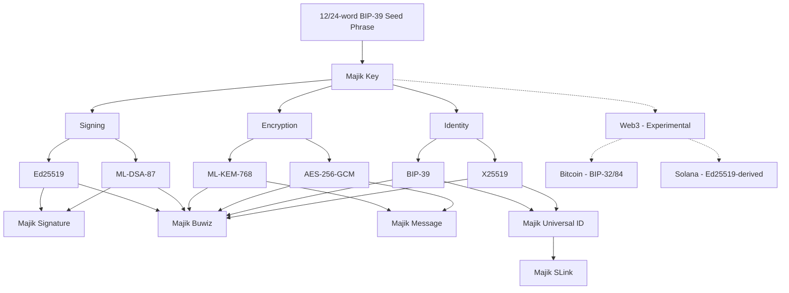

# Majik Key for Rust

[](https://www.thezelijah.world) 

[](https://doi.org/10.5281/zenodo.21339132) [](https://crates.io/crates/majik-key) [](https://docs.rs/majik-key) [](https://opensource.org/licenses/Apache-2.0)

**Majik Key** turns a single BIP-39 mnemonic into a complete cryptographic identity for Rust applications — encryption, classical + post-quantum signing, and experimental Bitcoin and Solana support — all encrypted at rest and ready to plug into the rest of the Majikah ecosystem.

---

## Why Majik Key

- **One seed, one identity, multiple key pairs.** A 12- or 24-word mnemonic deterministically derives X25519, ML-KEM-768, Ed25519, ML-DSA-87, and optional Bitcoin material — all reproducible from the mnemonic alone.
- **Post-quantum from day one.** Every account gets an ML-KEM-768 (FIPS-203) encryption keypair and an ML-DSA-87 signing keypair alongside their classical counterparts (X25519, Ed25519) — no separate migration project required later.
- **Encrypted at rest, always.** Private key material is never persisted in plaintext. Everything is AES-256-GCM encrypted using a key derived with Argon2id.
- **Local-first.** Key generation and derivation run entirely offline — no network request is made in the process, verifiable directly in source.
- **Built for the Majikah ecosystem**, but usable standalone in any Rust project.

---

## Security Architecture

- **Encrypted at rest, not "hashed."** Private keys are **AES-256-GCM encrypted**, using a 256-bit key **derived via Argon2id** from your passphrase. (Argon2id is a key-derivation function, not applied to the private key directly — the private key itself is encrypted, not hashed.)
- **Argon2id KDF (v2), memory-hard by design.** Passphrase-based encryption uses Argon2id at a memory-hard configuration tuned to resist brute-force attacks.
- **Post-quantum ready.** ML-KEM-768 (FIPS-203) is derived from the full 64-byte BIP-39 seed for encryption/key-encapsulation, and ML-DSA-87 is derived from a domain-separated hash of that same seed for signing — both deterministic and recoverable from the mnemonic.
- **Legacy KDF read support.** Older accounts encrypted with KDF v1 (PBKDF2-SHA256) can still be unlocked. New accounts, and any account whose passphrase is changed via `update_passphrase()`, always land on Argon2id (v2).
- **Full migration path.** `import_from_mnemonic_backup()` re-derives a complete identity straight from the mnemonic — X25519, ML-KEM-768, Ed25519, ML-DSA-87, and Bitcoin — and re-encrypts everything with Argon2id in one step, so an old account becomes fully post-quantum capable automatically. A lighter `migrate()` method is also available if you only want to upgrade the KDF version without re-deriving the newer key types.
- **Multi-language mnemonics.** BIP-39 wordlists for English, French, Spanish, Italian, Japanese, Korean, Czech, Portuguese, Simplified Chinese, and Traditional Chinese are supported via the underlying bip39 dependency.

---

## Architecture



Your Majik Key is generated entirely offline. No network request is made during key creation — verifiable in the source code.

---

## Powering the Majikah Ecosystem

Majik Key is the shared identity layer underneath every Majikah product. Here is what the Rust crate provides as the foundation for downstream integrations.

### Majik Signature

**Post-quantum cryptographic file signing and verification.**

The Rust crate exposes the core cryptographic material needed for hybrid signing workflows, including Ed25519 and ML-DSA-87 secrets and public keys.

### Majik Message

**Post-quantum secure messaging envelopes.**

The crate derives an ML-KEM-768 keypair specifically for post-quantum key encapsulation and encryption workflows. The `to_majik_message_identity()` entry point is available as a placeholder for future integration with the broader Majikah stack.

### Majik Buwiz

**Multi-key custody built on the full Majik Key stack.**

Majik Buwiz is built on the full Majik Key stack: Ed25519/ML-DSA-87 for signing, ML-KEM-768/AES-256-GCM for encryption, and X25519/BIP-39 for identity — plus the experimental Bitcoin and Solana support described below.

### Majik Universal ID & Majik SLink

**A portable identity primitive, and shareable links built on top of it.**

Majik Universal ID is built on the identity branch of Majik Key — the BIP-39-derived X25519 keypair, public key, and fingerprint. The Rust crate already exposes the core public and private identity material needed for these higher-level integrations.

---

## Experimental Web3 Support

Majik Key can derive **Bitcoin** and **Solana** key material directly from the same mnemonic. This is marked experimental — the Rust API may evolve as the integration matures.

### What is built in vs. what needs an extra feature

- **Bitcoin key derivation is available via the default feature set.** Accounts created via `MajikKey::create()` or `import_from_mnemonic_backup()` can derive and encrypt Bitcoin key material when the `bitcoin` feature is enabled.
- **Solana key derivation is available through the `solana` feature.** The crate exposes deterministic Solana material derived from Ed25519 signing material.
- **The optional peer dependencies are only needed for additional chain-native objects:**

| Chain   | Feature / dependency | Needed for                                         |
| :------ | :------------------- | :------------------------------------------------- |
| Bitcoin | `bitcoin` feature    | Native Bitcoin key derivation and address material |
| Solana  | `solana` feature     | Solana keypair material and address derivation     |

### Two Bitcoin paths, on purpose

By default, the crate uses the Majik-specific derivation flow for Bitcoin. If you want the standard BIP-84 mainnet path, use the standard derivation helper exposed by the crate:

```rust
use majik_key::MajikKey;

let material = MajikKey::derive_standard_bitcoin_from_mnemonic(
    "abandon abandon ...",
    majik_key::crypto::wordlist::MnemonicLanguage::En,
)?;
```

### Two Solana paths, on purpose

The Rust crate can derive Solana material either from a domain-separated seed or by reusing the Ed25519 signing secret directly, depending on the options you pass.

---

## Installation

Add the crate to your Cargo project:

```bash
cargo add majik-key
```

---

## Quick Start (Core Identity)

```rust
use majik_key::{MajikKey, MajikKeyCreateOptions, crypto::wordlist::MnemonicLanguage};
use zeroize::Zeroizing;

fn main() -> Result<(), Box<dyn std::error::Error>> {
    let mnemonic = Zeroizing::new(MajikKey::generate_mnemonic(128, MnemonicLanguage::En)?);
    let mut key = MajikKey::create(
        mnemonic.clone(),
        Zeroizing::new("super-secure-passphrase".to_string()),
        Some("My PQ Account"),
        MajikKeyCreateOptions::default(),
    )?;

    println!("Fingerprint: {}", key.fingerprint());
    println!("Key ID: {}", key.id());
    println!("Unlocked? {}", key.is_unlocked());

    key.lock();
    println!("Locked? {}", key.is_locked());

    key.unlock(Zeroizing::new("super-secure-passphrase".to_string()))?;
    let private_key = key.get_private_key()?;
    println!("Private key bytes: {}", private_key.len());

    Ok(())
}
```

---

## API Reference

### Core lifecycle and generation

| Method                                              | Parameters                                             | Returns                                  | Description                                                                               |
| :-------------------------------------------------- | :----------------------------------------------------- | :--------------------------------------- | :---------------------------------------------------------------------------------------- |
| `MajikKey::create()`                                | `mnemonic`, `passphrase`, `label`, `options`           | `MajikKeyResult<Self>`                   | Creates a new Argon2id-protected, fully post-quantum-capable account.                     |
| `MajikKey::from_json()`                             | `json`                                                 | `MajikKeyResult<Self>`                   | Loads a locked key from serialized JSON.                                                  |
| `MajikKey::from_mnemonic_json()`                    | `json`, `passphrase`, `label`, `options`               | `MajikKeyResult<Self>`                   | Rebuilds a key straight from a portable mnemonic export.                                  |
| `MajikKey::import_from_mnemonic_backup()`           | `backup`, `mnemonic`, `passphrase`, `label`, `options` | `MajikKeyResult<Self>`                   | Verifies the mnemonic, re-derives the identity, and re-encrypts everything with Argon2id. |
| `MajikKey::from_dangerous_json()`                   | `json`                                                 | `MajikKeyResult<Self>`                   | Reconstructs an already-unlocked key from a dangerous export.                             |
| `MajikKey::generate_mnemonic()`                     | `strength`, `language`                                 | `MajikKeyResult<String>`                 | Generates a 12- or 24-word BIP-39 phrase.                                                 |
| `MajikKey::validate_mnemonic_str()`                 | `mnemonic`                                             | `bool`                                   | Validates a BIP-39 mnemonic phrase.                                                       |
| `MajikKey::derive_standard_bitcoin_from_mnemonic()` | `mnemonic`, `language`                                 | `MajikKeyResult<BitcoinKeypairMaterial>` | Derives the standard BIP-84 mainnet Bitcoin key from a mnemonic.                          |

### State and management

| Method                | Parameters                             | Returns                     | Description                                                                 |
| :-------------------- | :------------------------------------- | :-------------------------- | :-------------------------------------------------------------------------- |
| `unlock()`            | `passphrase`                           | `MajikKeyResult<&mut Self>` | Decrypts keys into memory.                                                  |
| `lock()`              | none                                   | `&mut Self`                 | Purges private key material from memory.                                    |
| `verify()`            | `passphrase`                           | `bool`                      | Tests a passphrase without keeping keys in memory.                          |
| `update_passphrase()` | `current_passphrase`, `new_passphrase` | `MajikKeyResult<&mut Self>` | Re-encrypts every stored key under a new passphrase and migrates to KDF v2. |
| `migrate()`           | `passphrase`                           | `MajikKeyResult<&mut Self>` | Upgrades the X25519 key's KDF from v1 to v2 only.                           |
| `update_label()`      | `new_label`                            | `MajikKeyResult<&mut Self>` | Updates the human-readable account label.                                   |

### Export and integration

| Method                        | Returns                  | Description                                                                           |
| :---------------------------- | :----------------------- | :------------------------------------------------------------------------------------ |
| `to_json()`                   | `MajikKeyJson`           | Safe export for persistence.                                                          |
| `to_string_pretty()`          | `String`                 | Pretty-printed serialized JSON.                                                       |
| `to_dangerous_json()`         | `MajikKeyDangerousJson`  | ⚠️ Contains every raw private key.                                                     |
| `to_mnemonic_json()`          | `MnemonicJson`           | ⚠️ Contains the raw mnemonic words in plaintext and is intended as a transport format. |
| `export_mnemonic_backup()`    | `MajikKeyResult<String>` | Creates an encrypted backup string tied to the mnemonic.                              |
| `to_contact()`                | `MajikKeyResult<()>`     | Placeholder for the higher-level contact integration layer.                           |
| `to_majik_message_identity()` | `MajikKeyResult<()>`     | Placeholder for the higher-level Majik Message identity integration layer.            |

### Instance getters

- Public values: `id()`, `fingerprint()`, `public_key()`, `public_key_base64()`, `label()`, `backup()`, `timestamp()`, `mnemonic_language()`, `kdf_version()`, `is_argon2id()`, `is_locked()`, `is_unlocked()`, `is_fully_upgraded()`, `ml_kem_public_key()`, `has_ml_kem()`, `ed_public_key()`, `ml_dsa_public_key()`, `has_signing_keys()`, `btc_public_key()`, `has_bitcoin()`, `metadata()`.
- Restricted values (require unlocking): `get_private_key()`, `get_ml_kem_secret_key()`, `get_ed_secret_key()`, `get_ml_dsa_secret_key()`.

### Web3 (Experimental)

| Member                                    | Returns                  | Notes                                                 |
| :---------------------------------------- | :----------------------- | :---------------------------------------------------- |
| `get_bitcoin_keypair_material()`          | `BitcoinKeypairMaterial` | Raw Bitcoin keypair bytes.                            |
| `derive_standard_bitcoin_from_mnemonic()` | `BitcoinKeypairMaterial` | Standard BIP-84 mainnet path from mnemonic.           |
| `get_solana_keypair_material()`           | `SolanaKeypairMaterial`  | Solana keypair material derived from Ed25519 secrets. |

---

## Usage Examples

### 1. Secure Backup & Recovery Workflow

```rust
use majik_key::{MajikKey, MajikKeyCreateOptions, crypto::wordlist::MnemonicLanguage};
use zeroize::Zeroizing;

let mnemonic = Zeroizing::new("abandon abandon ...".to_string());
let passphrase = Zeroizing::new("password123".to_string());
let key = MajikKey::create(
    mnemonic.clone(),
    passphrase.clone(),
    Some("Recovered Key"),
    MajikKeyCreateOptions::default(),
)?;

let backup = key.export_mnemonic_backup(mnemonic.clone())?;
let restored = MajikKey::import_from_mnemonic_backup(
    &backup,
    mnemonic.clone(),
    passphrase.clone(),
    Some("Recovered Key"),
    MajikKeyCreateOptions::default(),
)?;
```

### 2. Password Verification Before Action

```rust
let key = MajikKey::from_json(&json)?;

if key.verify("user-input-password") {
    let mut unlocked = key;
    unlocked.unlock(Zeroizing::new("user-input-password".to_string()))?;
    // ... proceed with cryptographic operations
    unlocked.lock();
} else {
    println!("Invalid passphrase");
}
```

### 3. Server-Side Secret Injection (Dangerous JSON)

`to_dangerous_json()` / `from_dangerous_json()` skip encryption entirely — no KDF, no AES-GCM, instant reconstruction. This exists for the narrow case of injecting pre-unlocked secret material into a trusted server process.

```rust
let dangerous = key.to_dangerous_json()?;
let server_key = MajikKey::from_dangerous_json(&dangerous)?;
```

### 4. Experimental Web3 Usage

```rust
let bitcoin = key.get_bitcoin_keypair_material(None)?;
let solana = key.get_solana_keypair_material(None)?;
```

---

## Security Best Practices

✅ **DO:**
- Call `.lock()` immediately after signing or decrypting payloads to free key material from memory.
- Use ML-KEM public keys for new communication protocols to stay post-quantum ready.
- Keep the underlying cryptography dependencies up to date.
- Treat any mnemonic export as the master secret — it can recover everything.

❌ **DON'T:**
- Log mnemonic phrases, private keys, or any `*secret_key*` material in production.
- Use `to_dangerous_json()` / `from_dangerous_json()` outside of controlled, server-side secret injection.
- Store mnemonic transport exports unencrypted — they are not the same as a safe persisted JSON export.

---

## Ecosystem

- [Majik Signature Web App](https://signature.majikah.solutions)
- [Majik Signature on Microsoft Store](https://apps.microsoft.com/detail/9pl9g3xzvd1x)
- [Majik Signature Official Repository](https://github.com/Majikah/majik-signature)
- [Majikah Solutions](https://majikah.solutions)

---

## License

**License:** [Apache-2.0](LICENSE) — free for personal and commercial use.

## Author

Developed by **Josef Elijah Fabian (Zelijah)** | [Majikah Solutions OPC](https://majikah.solutions/about)

**Developer**: [Josef Elijah Fabian](https://github.com/jedlsf)

**GitHub**: [https://github.com/Majikah](https://github.com/Majikah)

**Project Repository**: [https://github.com/Majikah/majik-key-rs](https://github.com/Majikah/majik-key-rs)

**Technical Whitepaper**: [https://zenodo.org/records/21339132](https://zenodo.org/records/21339132)

---

## Contact

- **Business Email**: [business@majikah.solutions](mailto:business@majikah.solutions)
- **Official Website**: [https://www.thezelijah.world](https://www.thezelijah.world)
- **Majikah Ecosystem**: [https://majikah.solutions](https://majikah.solutions)
